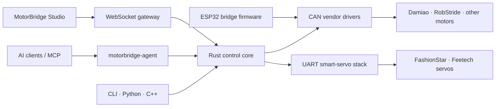

<h1>tianrking</h1>

<strong>Independent Systems Builder · Open-source Engineer</strong>

<em>Ideas que funcionan. Sistemas que se verifican. Productos que llegan al mundo real.</em>

  <code>Embedded Systems</code> ·
  <code>Robotics</code> ·
  <code>Edge Infrastructure</code> ·
  <code>Developer Tools</code> ·
  <code>Applied AI</code>

  <a href="#top-repositories">Top projects</a> ·
  <a href="#motorbridge--full-stack-motor-control-ecosystem">MotorBridge</a> ·
  <a href="#open-source-impact--merged-prs-2026">Open source</a>

---

## About me

I build across the entire stack — from **silicon, firmware and physical protocols** to **systems software, product interfaces, edge infrastructure and AI agents**. My work is grounded in real hardware, reproducible failures, focused tests and deployable systems.

<table>
<tr>
<td width="24%" valign="top"><strong>🔩 Silicon & boards</strong></td>
<td>Espressif <strong>ESP8266 / ESP32-C3 / C6 / S3 / P4</strong> · Raspberry Pi <strong>RP2040</strong> · <strong>STM32 / GD32</strong> · Nordic <strong>nRF52 / nRF54</strong> · HiSilicon <strong>WS63 / Hi3863</strong> · <strong>JL7016</strong> audio SoC · Wio Terminal · <strong>Tang Nano 9K / AGM FPGA</strong> · <strong>NXP SE05x</strong> secure elements</td>
</tr>
<tr>
<td valign="top"><strong>⚙️ Firmware & embedded</strong></td>
<td><strong>ESP-IDF · Zephyr / nRF Connect SDK · FreeRTOS · NuttX · Arduino · PlatformIO</strong> · micro-ROS / ROS 2 · LVGL · Renode · QEMU · KiCad · board bring-up, boot flows, drivers, diagnostics and hardware-in-the-loop testing</td>
</tr>
<tr>
<td valign="top"><strong>📡 Protocols & buses</strong></td>
<td><strong>BLE · USB / HID · CAN / TWAI / CAN-FD · UART · I²C · SPI</strong> · NFC / APDU · IEEE 802.15.4 · ESP-NOW · MQTT · WebSocket · MAVLink · packet capture, protocol analysis and cross-device interoperability</td>
</tr>
<tr>
<td valign="top"><strong>🤖 Robotics & control</strong></td>
<td><strong>MotorBridge</strong> · Damiao and RobStride motors · Feetech and FashionStar servos · FOC · grippers · real-time motion, calibration and safety · Reachy / LeRobot · ROS 2, RViz and browser-based operator tooling</td>
</tr>
<tr>
<td valign="top"><strong>🦀 Languages & systems</strong></td>
<td><strong>Rust · C · C++ · Go · Python · TypeScript / JavaScript</strong> · Swift · Kotlin · Java · Shell / PowerShell · Verilog · MATLAB · CMake / Make · FFI, stable C ABIs, PyO3, WebAssembly and cross-platform diagnostics</td>
</tr>
<tr>
<td valign="top"><strong>🌐 Apps & infrastructure</strong></td>
<td><strong>React · Next.js · Vite · Qt · Android · SwiftUI · Electron</strong> · Cloudflare Workers · Vercel · Docker · Linux / Windows / macOS · self-hosted services, edge caching, proxy and egress systems, streaming APIs, automation and deployment</td>
</tr>
<tr>
<td valign="top"><strong>🧠 AI, data & open source</strong></td>
<td><strong>LLM agents · MCP · applied AI integrations</strong> · prediction-market and quantitative tooling · monitoring and guarded execution · reproducible bug reports, targeted fixes, regression tests and maintainable upstream contributions</td>
</tr>
</table>

## Top repositories

*Flagship projects with real users, real deployments, and independently verifiable results.*

<table>
<tr>
<td width="50%" valign="top">

### [proxychains-rs](https://github.com/tianrking/proxychains-rs)

A modern Rust implementation of process-level proxy chaining across **Linux, macOS and Windows**, using preload injection and native Winsock hooks. Supports multiple proxy protocols, chain modes, groups, process trees, DNS handling and health probes.

</td>
<td width="50%" valign="top">

### [EdgeMirror](https://github.com/tianrking/EdgeMirror)

A CDN-style edge mirror gateway for developer sources: **PyPI, PyTorch, Hugging Face, GitHub, Docker, Linux mirrors, npm, Go, Maven and crates.io**, with shared caching, upstream fallback and one-click Cloudflare/Vercel deployment.

</td>
</tr>
<tr>
<td width="50%" valign="top">

### [Re_edgetunnel](https://github.com/tianrking/Re_edgetunnel)

A modular Cloudflare Workers tunnel rebuilt around **ESM, Wrangler and KV-backed configuration**. Includes VLESS/Trojan support and subscription generation for Clash, sing-box and Surge.

</td>
<td width="50%" valign="top">

### [AnyTLS-Go-Script](https://github.com/tianrking/AnyTLS-Go-Script)

An interactive **AnyTLS-Go installation and management script** with dependency setup, systemd lifecycle management, architecture detection, guided configuration, log inspection, mobile QR profiles and clean removal.

</td>
</tr>
</table>

## MotorBridge · full-stack motor control ecosystem

> **From natural-language intent and browser controls to deterministic CAN/UART motor commands.**

[MotorBridge](https://github.com/motorbridge) connects high-level applications and AI agents all the way down to real motors. It is not a single demo: the organization separates protocol-independent control, hardware transports, browser tooling, embedded firmware, smart servos and agent integration into reusable layers.

| Layer | Repository | Role |
|---|---|---|
| Control core | [motorbridge](https://github.com/motorbridge/motorbridge) | Vendor-agnostic Rust CAN core, stable C ABI, Python/C++ bindings, CLI, WebSocket gateway and reliability tools |
| Operator UI | [motorbridge-studio](https://github.com/motorbridge/motorbridge-studio) | React/Vite control studio for scanning, configuration, enable/disable, MIT, position/velocity and force-position modes |
| Embedded bridge | [motorbridge-esp32](https://github.com/motorbridge/motorbridge-esp32) | Layered ESP-IDF 5.5 firmware with TWAI transport, host protocol, safety manager, NVS parameters and vendor plugins |
| Smart servos | [motorbridge-smart-servo](https://github.com/motorbridge/motorbridge-smart-servo) | Rust-first UART servo stack with native CLI, C ABI, PyO3 wheels and a WASM reliability core |
| AI control | [motorbridge-agent](https://github.com/motorbridge/motorbridge-agent) | MCP server that turns natural-language instructions into guarded motor-control operations, with hardware-free demo mode |

## Open-source impact · merged PRs (2026)

Contributions merged into third-party projects, selected for either **community reach or technical substance**. Entries are ordered by current community reach; star badges update live, and every linked PR is verified as merged upstream in 2026.

| Upstream project | Community | My merged contribution |
|---|---|---|
| [**farion1231/cc-switch**](https://github.com/farion1231/cc-switch) |  |  Added provider-specific terminal launches with isolated API configurations across macOS, Linux and Windows. |
| [**HKUDS/nanobot**](https://github.com/HKUDS/nanobot) |  |  Added DingTalk channel support. |
| [**multica-ai/multica**](https://github.com/multica-ai/multica) |  |  Fixed workspace filter synchronization and aligned CLI/self-hosting documentation. |
| [**calesthio/OpenMontage**](https://github.com/calesthio/OpenMontage) |  |  Corrected delayed audio-fade scheduling with focused FFmpeg regression coverage. |
| [**pnpm/pnpm**](https://github.com/pnpm/pnpm) |  |  Fixed symlinked lockfile installs while preserving safe, atomic write behavior. |
| [**filebrowser/filebrowser**](https://github.com/filebrowser/filebrowser) |  |  Ensured directory creation runs the configured upload-hook lifecycle. |
| [**sipeed/picoclaw**](https://github.com/sipeed/picoclaw) |  |  Added DingTalk channel support through WebSocket Stream Mode. |
| [**davila7/claude-code-templates**](https://github.com/davila7/claude-code-templates) |  |  Fixed broken template navigation and documentation links. |
| [**lbjlaq/Antigravity-Manager**](https://github.com/lbjlaq/Antigravity-Manager) |  |  Removed synchronous disk I/O from token sorting by caching quotas in memory. |
| [**HKUDS/DeepTutor**](https://github.com/HKUDS/DeepTutor) |  |  Aligned the WeCom channel with SDK 1.0.8 and added lifecycle regression coverage. |
| [**actualbudget/actual**](https://github.com/actualbudget/actual) |  |  Refreshed running balances after transaction edits. |
| [**wezterm/wezterm**](https://github.com/wezterm/wezterm) |  |  Guarded shell integration against an unset `ZSH_NAME`. |
| [**HKUDS/Vibe-Trading**](https://github.com/HKUDS/Vibe-Trading) |  |  Rebuilt the hash-verified runtime lock to restore Docker dependency installation. |
| [**slopus/happy**](https://github.com/slopus/happy) |  |  Implemented accurate Claude model cost calculation. |
| [**diegosouzapw/OmniRoute**](https://github.com/diegosouzapw/OmniRoute) |  |  Normalized Turbopack-hashed externals in Electron standalone packages. |
| [**RightNow-AI/openfang**](https://github.com/RightNow-AI/openfang) |  |  Added an MQTT publish/subscribe channel adapter. |
| [**DevAgentForge/Open-Claude-Cowork**](https://github.com/DevAgentForge/Open-Claude-Cowork) |  |  Fixed packaged macOS session creation by deferring Electron-dependent initialization. |
| [**enfein/mieru**](https://github.com/enfein/mieru) |  |  Hardened traffic anti-detection with entropy padding and randomized heartbeats. |
| [**pollen-robotics/reachy-mini-desktop-app**](https://github.com/pollen-robotics/reachy-mini-desktop-app) |  |  Fixed Windows Unicode startup failures and version compatibility in the packaged Reachy Mini desktop app. |

## Project directions

Across my public, private, and organization work, I focus on a few connected directions:

- **Embedded systems & robotics** — MCU firmware, BLE/USB/CAN protocols, sensing, motor control, robot tooling and hardware bring-up.
- **Networking & private infrastructure** — proxy systems, egress control, edge acceleration, self-hosted services and deployment automation.
- **Developer tools & applied AI** — cross-platform diagnostics, agent workflows, desktop/web products and practical AI integrations.
- **Markets & data systems** — prediction-market research, market-data adapters, guarded execution, monitoring and quantitative experiments.
- **Product engineering** — turning experiments into testable tools with clear boundaries, focused verification and maintainable delivery.

---

**Construir. Verificar. Llevarlo al mundo real.**

