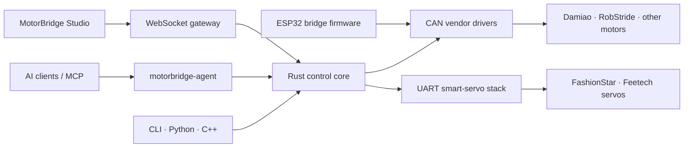

# Hi, I'm tianrking 👋

**Independent builder · Open-source contributor · Systems tinkerer**

把想法做成能运行、能验证、能落地的系统。  
I build practical systems that can be tested, shipped, and maintained.

## About me

I work across **embedded hardware, robotics, networking, developer tools, web/desktop software, applied AI, and market research systems**. I like tracing a problem to its real boundary, implementing the smallest reliable fix, and proving it with focused tests.

- 🔩 **Hardware & protocols:** ESP32, RP2040, STM32, BLE, USB, CAN, secure elements, robotics
- 🦀 **Systems & tooling:** Rust, Go, Python, TypeScript, cross-platform diagnostics
- 🌐 **Product engineering:** self-hosted services, desktop/web apps, automation and deployment
- 🤝 **Open source:** reproducible bug reports, targeted fixes, regression tests and maintainable integrations
- 🧭 **Current interests:** reliable agent workflows, protocol analysis, private infrastructure and prediction-market tooling

## Popular original projects

| Project | What it solves | Technical core |
|---|---|---|
| [**proxychains-rs**](https://github.com/tianrking/proxychains-rs)  | Modern, cross-platform process-level proxy chaining for Linux, macOS and Windows | Rust · LD_PRELOAD · DYLD injection · MinHook/Winsock |
| [**EdgeMirror**](https://github.com/tianrking/EdgeMirror)  | One edge gateway for accelerating PyPI, Hugging Face, GitHub, Docker, npm, Go, Maven, crates.io and Linux mirrors | Cloudflare Workers · Vercel · caching · resilient upstream routing |
| [**Re_edgetunnel**](https://github.com/tianrking/Re_edgetunnel)  | Engineering-oriented Cloudflare tunnel implementation with modular configuration and subscription generation | ESM · Cloudflare KV · WebSocket · VLESS/Trojan |
| [**AnyTLS-Go-Script**](https://github.com/tianrking/AnyTLS-Go-Script)  | Install, configure, update, inspect and remove AnyTLS-Go from one interactive script | Shell · systemd · multi-architecture Linux · QR configuration |
| [**xcode-proxy**](https://github.com/tianrking/xcode-proxy)  | Connect Xcode and editor AI features to OpenRouter, DeepSeek, Anthropic and OpenAI-compatible providers | Python · dynamic TOML routing · streaming protocol adaptation |
| [**ClawRemove**](https://github.com/tianrking/ClawRemove)  | Inspect, audit and safely clean environments where AI agents and local models run | Go · cross-platform single binary · runtime/storage/key inspection |
| [**grok-api-proxy**](https://github.com/tianrking/grok-api-proxy)  | Edge proxy for xAI Grok with client-owned credentials and streaming support | Cloudflare Workers · OpenAI-compatible HTTP/SSE |
| [**DM_Gripper**](https://github.com/tianrking/DM_Gripper)  | Real-time DM-J4310 gripper calibration, manual control and automatic motion workflows | Python · React · WebSocket · CAN motor control |
| [**RobStride_Control**](https://github.com/tianrking/RobStride_Control)  | Multi-language high-performance control implementations for RobStride motors | C++ · Rust · Python · Arduino/ESP32 · SocketCAN |
| [**appstore-price**](https://github.com/tianrking/appstore-price)  | Global App Store and in-app-purchase price comparison with exchange-rate tracking | Next.js · React · TypeScript · Cloudflare/Vercel |

## MotorBridge · full-stack motor control ecosystem

[MotorBridge](https://github.com/motorbridge) connects high-level applications and AI agents all the way down to real motors. It is not a single demo: the organization separates protocol-independent control, hardware transports, browser tooling, embedded firmware, smart servos and agent integration into reusable layers.

| Layer | Repository | Role |
|---|---|---|
| Control core | [motorbridge](https://github.com/motorbridge/motorbridge) | Vendor-agnostic Rust CAN core, stable C ABI, Python/C++ bindings, CLI, WebSocket gateway and reliability tools |
| Operator UI | [motorbridge-studio](https://github.com/motorbridge/motorbridge-studio) | React/Vite control studio for scanning, configuration, enable/disable, MIT, position/velocity and force-position modes |
| Embedded bridge | [motorbridge-esp32](https://github.com/motorbridge/motorbridge-esp32) | Layered ESP-IDF 5.5 firmware with TWAI transport, host protocol, safety manager, NVS parameters and vendor plugins |
| Smart servos | [motorbridge-smart-servo](https://github.com/motorbridge/motorbridge-smart-servo) | Rust-first UART servo stack with native CLI, C ABI, PyO3 wheels and a WASM reliability core |
| AI control | [motorbridge-agent](https://github.com/motorbridge/motorbridge-agent) | MCP server that turns natural-language instructions into guarded motor-control operations, with hardware-free demo mode |

## Current deep-build projects

| Project | Focus |
|---|---|
| [SonicPair](https://github.com/tianrking/SonicPair) | Browser-native near-ultrasonic pairing with local cryptography and a live two-device workflow |
| [Véspero](https://github.com/tianrking/Vespero) | Self-hosted pluggable egress control behind one stable proxy endpoint |
| [BLE Analyzer Pro RS](https://github.com/tianrking/BLE-Analyzer-Pro-rs) | Rust-native WCH BLE Analyzer capture, discovery and PCAP workflow |
| [PolyAlpha](https://github.com/tianrking/PolyAlpha) | Polymarket research, cross-market strategy analysis and live tracking |
| [ESP32 Micro-ROS](https://github.com/tianrking/ESP32_MicroROS) | Embedded ROS 2 experiments and reference firmware for ESP32 |

## Selected merged contributions · 2026

Only substantial, successfully merged work is highlighted here. Closed-without-merge entries, routine maintenance-only changes, and Seeed documentation work are intentionally omitted.

<strong>View merged PRs and concrete changes</strong>

### Developer tools & infrastructure

- [wezterm/wezterm#7942](https://github.com/wezterm/wezterm/pull/7942) — guarded shell integration against an unset `ZSH_NAME`.
- [pnpm/pnpm#13075](https://github.com/pnpm/pnpm/pull/13075) — fixed installs when `pnpm-lock.yaml` is a symlink.
- [filebrowser/filebrowser#6034](https://github.com/filebrowser/filebrowser/pull/6034) — ensured upload hooks also run for directories.
- [actualbudget/actual#8490](https://github.com/actualbudget/actual/pull/8490) — refreshed running balances after transaction edits.
- [enfein/mieru#272](https://github.com/enfein/mieru/pull/272) — hardened anti-detection behavior through entropy padding and randomized heartbeats.
- [diegosouzapw/OmniRoute#7353](https://github.com/diegosouzapw/OmniRoute/pull/7353) — normalized hashed standalone externals in Electron builds.
- [calesthio/OpenMontage#391](https://github.com/calesthio/OpenMontage/pull/391) — corrected delayed audio fade scheduling.
- [multica-ai/multica#722](https://github.com/multica-ai/multica/pull/722) — fixed workspace-filter synchronization and aligned CLI documentation.

### AI agents, channels & desktop apps

- [RightNow-AI/openfang#665](https://github.com/RightNow-AI/openfang/pull/665) — added an MQTT publish/subscribe channel adapter.
- [HKUDS/nanobot#219](https://github.com/HKUDS/nanobot/pull/219) — added DingTalk channel support.
- [sipeed/picoclaw#12](https://github.com/sipeed/picoclaw/pull/12) — implemented DingTalk Stream Mode integration.
- [lbjlaq/Antigravity-Manager#1627](https://github.com/lbjlaq/Antigravity-Manager/pull/1627) — optimized token sorting by caching quota data in memory.
- [slopus/happy#484](https://github.com/slopus/happy/pull/484) — implemented accurate Claude model cost calculation.
- [pollen-robotics/reachy-mini-desktop-app#133](https://github.com/pollen-robotics/reachy-mini-desktop-app/pull/133) — fixed Windows encoding and compatibility behavior.
- [DevAgentForge/Open-Claude-Cowork#33](https://github.com/DevAgentForge/Open-Claude-Cowork/pull/33) — fixed session-title retrieval in packaged macOS builds.
- [HKUDS/DeepTutor#631](https://github.com/HKUDS/DeepTutor/pull/631) — aligned the WeCom integration with SDK 1.0.8.

## Project directions

Across my public, private, and organization work, I focus on a few connected directions:

- **Embedded systems & robotics** — MCU firmware, BLE/USB/CAN protocols, sensing, motor control, robot tooling and hardware bring-up.
- **Networking & private infrastructure** — proxy systems, egress control, edge acceleration, self-hosted services and deployment automation.
- **Developer tools & applied AI** — cross-platform diagnostics, agent workflows, desktop/web products and practical AI integrations.
- **Markets & data systems** — prediction-market research, market-data adapters, guarded execution, monitoring and quantitative experiments.
- **Product engineering** — turning experiments into testable tools with clear boundaries, focused verification and maintainable delivery.

---

**Build it. Verify it. Keep the boundary honest.**

